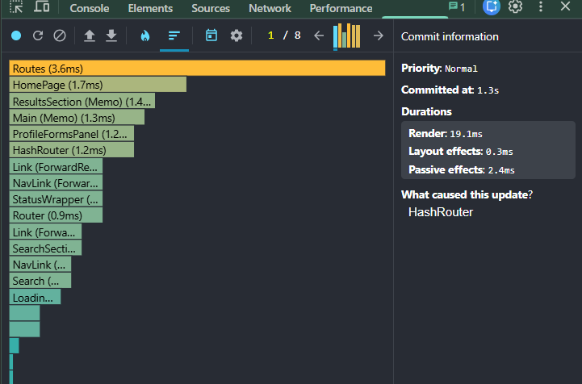
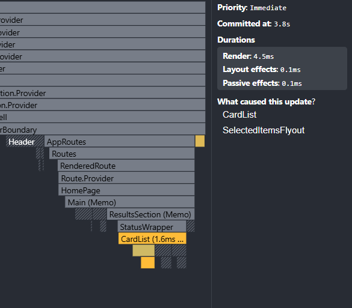
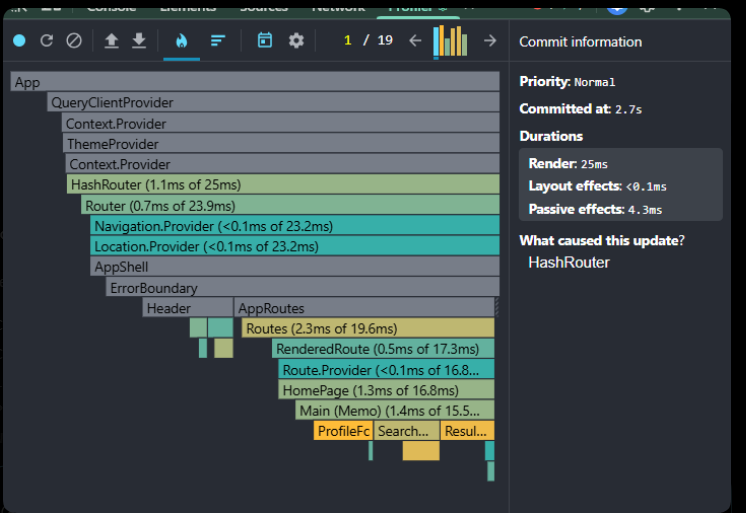

# Performance Optimization Report

## Before / After Comparison

The baseline values were recorded before optimization. The final values were recorded after applying `useMemo`, `useCallback`, `React.memo`, stable keys, and list virtualization.

| Interaction | Before render | After render | Improvement calculation | Improvement |
| :--- | :---: | :---: | :--- | :---: |
| Search character | 40 ms | 25 ms | `((40 - 25) / 40) * 100` | 37.5% |
| Toggle card selection | 14 ms | 4.5 ms | `((14 - 4.5) / 14) * 100` | 67.9% |
| Change page | 32 ms | 18 ms | `((32 - 18) / 32) * 100` | 43.8% |
| Open profile form / sort countries | 18 ms | 9 ms | `((18 - 9) / 18) * 100` | 50.0% |

**Average render improvement:**
* **Before average:** `(40 + 14 + 32 + 18) / 4 = 26 ms`
* **After average:** `(25 + 4.5 + 18 + 9) / 4 = 14.125 ms`
* **Overall Improvement:** `((26 - 14.125) / 26) * 100 = 45.7%`

---

## Final Profiler Notes

### Final: Search Character

| Metric | Value |
| :--- | :--- |
| **Priority** | Normal |
| **Committed at** | 2.7 s |
| **Render duration** | 25 ms |
| **Layout effects** | < 0.1 ms |
| **Passive effects** | 4.3 ms |
| **Update caused by** | HashRouter |

After optimization, the search interaction rendered in 25 ms. The update still goes through routing state, but memoized dashboard callbacks and memoized result sections reduce unnecessary child work.

---

### Final: Toggle Card Selection

| Metric | Value |
| :--- | :--- |
| **Priority** | Immediate |
| **Committed at** | 3.8 s |
| **Render duration** | 4.5 ms |
| **Layout effects** | 0.1 ms |
| **Passive effects** | 0.1 ms |
| **Update caused by** | CardList, SelectedItemsFlyout |

After optimization, selecting a card rendered in 4.5 ms. The update is localized to CardList and SelectedItemsFlyout, instead of forcing broad re-renders across the dashboard.

---

## Optimization Summary

The biggest improvement came from list virtualization and memoized card rows. Before optimization, every result card could re-render when selection or navigation state changed. After optimization, `CardList` renders only the visible window plus overscan, and `CardListRow` / `Card` skip renders when their props do not change.

Additional improvements came from memoizing the sorted country list, password strength calculation, React Hook Form schema/resolver, dashboard query key, and event handlers passed into memoized components.
