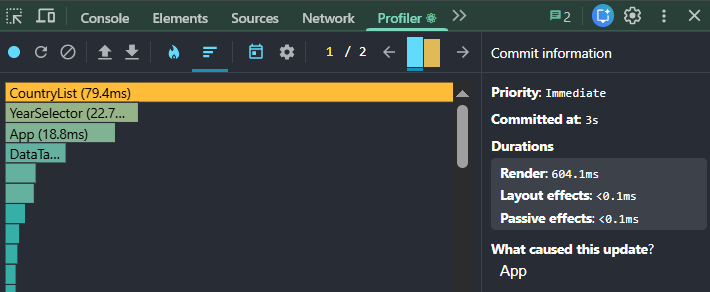
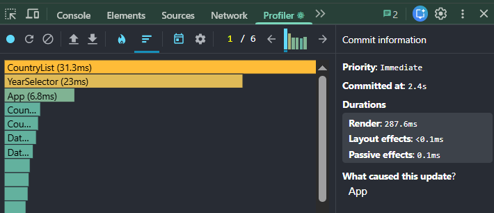
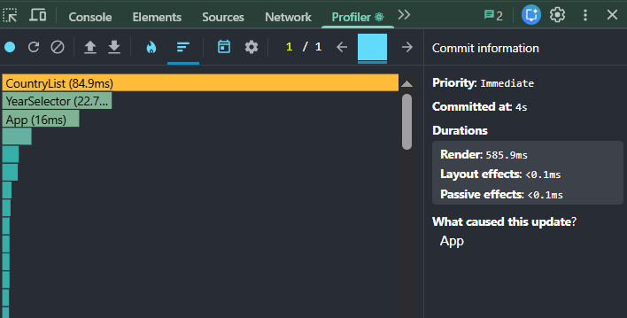
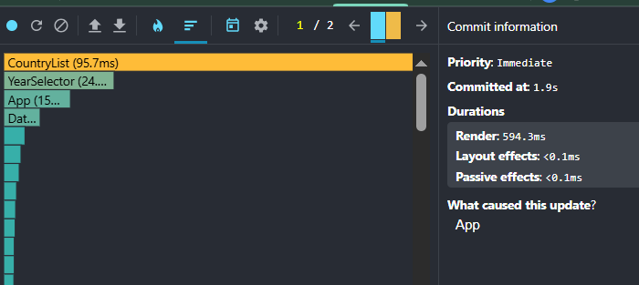
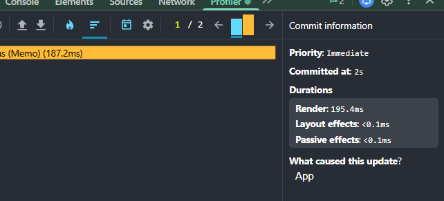
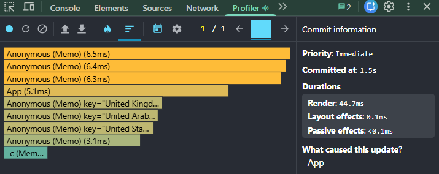
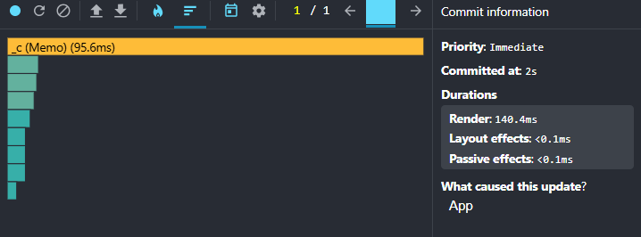
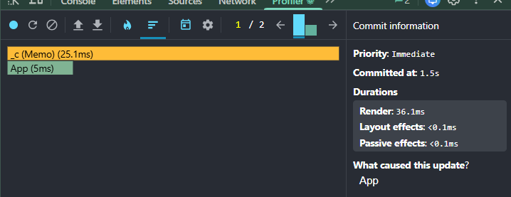

# Performance Optimization Report

## Baseline Measurements

### Interaction A: Sort countries

- **Commit duration**: 3 s
- **Render duration**: 604/1ms
- **Screenshot**: 

### Interaction B: Search countries

- **Commit duration**: 2.4s
- **Render duration**: 287 ms
- **Screenshot**: 

### Interaction C: Change year

- **Commit duration**: 4 s
- **Render duration**: 585ms
- **Screenshot**: 

### Interaction D: Toggle column

- **Commit duration**: 1.9 s
- **Render duration**: 594 ms
- **Screenshot**: 

## Optimized Measurements

### Interaction A: Sort countries

- **Commit duration**: 2 s
- **Render duration**: 195 ms
- **Screenshot**: 

### Interaction B: Search countries

- **Commit duration**: 1.5 s
- **Render duration**: 44 ms
- **Screenshot**: 

### Interaction C: Change year

- **Commit duration**: 2 s
- **Render duration**: 140 ms
- **Screenshot**: 

### Interaction D: Toggle column

- **Commit duration**: 1.5 s
- **Render duration**: 36 ms
- **Screenshot**: 

## Summary of Improvements

## Summary of Improvements

| Interaction      | Baseline (ms) | Optimized (ms) | Improvement |
| ---------------- | ------------- | -------------- | ----------- |
| Sort countries   | 604           | 195            | 67.72%      |
| Search countries | 287           | 44             | 84.67%      |
| Change year      | 585           | 140            | 76.07%      |
| Toggle column    | 594           | 36             | 93.94%      |
| **Average** | **517.5** | **103.8** | **79.95%** |
